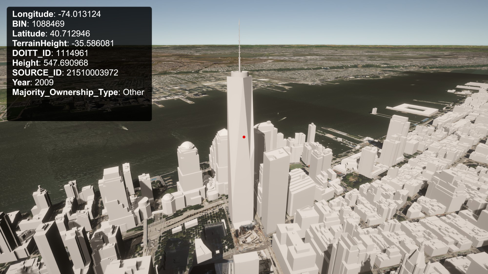

# Cesium for Unity Samples

The Cesium for Unity Samples is a starter project to learn and explore the [Cesium for Unity](https://cesium.com/platform/cesium-unity?utm_source=cesium-unity&utm_medium=github&utm_campaign=unity) plugin.

The scenes in this project will walk you through the plugin's features and demonstrate global-scale content, applications, and experiences in Unity 3D.

*
Photogrammetry of San Francisco, California visualized in Unity, using Cesium for Unity. Open the <b>03_CesiumSanFrancisco</b> scene in Cesium for Unity Samples to experience it yourself!
*

### :rocket: Get Started

1. **[Download Cesium for Unity Samples](https://github.com/CesiumGS/cesium-unity-samples/releases)**.
2. Extract the `.zip` file into a suitable location on your computer.
3. If you have [Unity Hub](https://unity.com/unity-hub) installed, click the "Open" button under the "Projects" tab. Otherwise, open the Unity Editor directly and select "Open Project". Then, point it to the extracted directory. Unity will load the project and also download Cesium for Unity using the Package Manager.
4. In the Asset Browser, select and load `Assets -> Scenes -> 01_CesiumWorld`. You can also select other scenes as you browse and explore the samples.

Have questions? Ask them on the [community forum](https://community.cesium.com).

## :mountain: Level Descriptions

### :one: Level 1 - Cesium World

The sample levels begin with a scene in San Francisco. You'll see [Cesium World Terrain](https://cesium.com/platform/cesium-ion/content/cesium-world-terrain/) and [Cesium OSM Buildings](https://cesium.com/platform/cesium-ion/content/cesium-osm-buildings/) in this scene. This level is designed to familiarize you with the core Cesium game objects and components, like Cesium World Terrain and Cesium Georeference.

Be sure to sign into your Cesium ion account using the Cesium button in the toolbar.

### :two: Level 2 - Melbourne Photogrammetry

In this scene, explore high-resolution photogrammetry data of Melbourne. This data is streamed from Cesium ion with the 3D Tiles format, a spatial index for streaming massive 3D content over the web. 3D Tiles makes it possible to stream hundreds of gigabytes of data over the web using hierarchical level of detail, spatial subdivision, and runtime optimizations.

See how this scene was created with the [Adding Datasets tutorial](https://cesium.com/learn/unity/unity-datasets/).

### :three: Level 3 - San Francisco Photogrammetry with a Unity Character Controller

In this scene, explore even more high-resolution photogrammetry data of San Francisco using a third-person character controller. Whereas Melbourne allowed you to freely fly around and explore, in this scene you'll walk right up to the real-world data. When streaming content through Cesium for Unity, physics and gravity will continue to work as expected with your character controllers.

Grab some cool screenshots to share with us as you explore and customize the scenes.

 and visualized in Unity 3D using Cesium for Unity.](Images~/ferry_building.jpg)
*
Photogrammetry of the Ferry Building in San Francisco, CA captured by [Aerometrex](https://aerometrex.com.au/). Open <b>03_CesiumSanFrancisco</b> in the Cesium for Unity Samples to walk around the dataset.
*

### :four: Level 4 - Metadata

Cesium for Unity enables you to access metadata encoded in your 3D Tiles datasets. In this scene, explore the buildings in New York City and see what information is included in the tileset about each building.

*
Metadata of New York City buildings visualized. Open <b>04_CesiumMetadata</b> in the Cesium for Unity Samples to explore the New York City buildings' metadata.
*

### :green_book:License

[Apache 2.0](http://www.apache.org/licenses/LICENSE-2.0.html). Cesium for Unity Samples is free to use as starter project for both commercial and non-commercial use.
